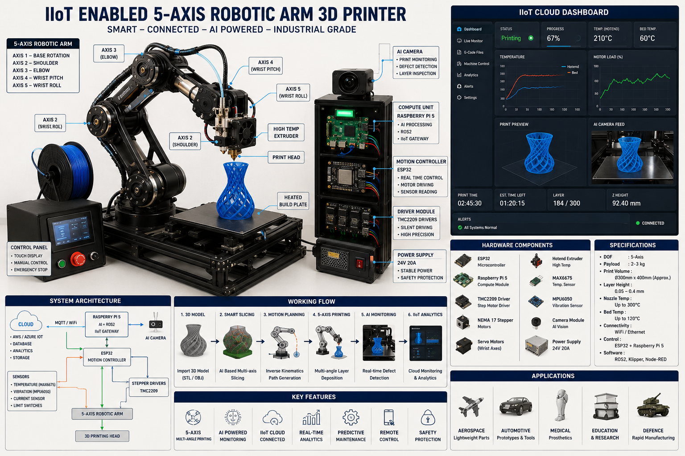

# 🤖 IIoT AI-Enabled 5-Axis Robotic Arm 3D Printer

## 🚀 Project Overview



The **IIoT AI-Enabled 5-Axis Robotic Arm 3D Printer** is an advanced industrial-grade additive manufacturing system that combines:

- 5-Axis Robotic Manipulation
- Industrial Internet of Things (IIoT)
- Artificial Intelligence
- ROS2 Robotics Framework
- Computer Vision
- Cloud Monitoring
- Predictive Maintenance

Unlike traditional Cartesian 3D printers, this system enables:

✅ Multi-directional printing  
✅ Curved surface deposition  
✅ Reduced support structures  
✅ Real-time AI monitoring  
✅ Remote cloud control  
✅ Predictive maintenance analytics

---

# 🧠 Key Features

## 🔹 5-Axis Robotic Printing

- Multi-axis movement
- Complex geometry printing
- Curved layer deposition
- High flexibility manufacturing

## 🔹 IIoT Connectivity

- MQTT communication
- Cloud synchronization
- Remote dashboard monitoring
- Real-time telemetry

## 🔹 AI Monitoring

- Defect detection
- Layer inspection
- Predictive maintenance
- Smart anomaly detection

## 🔹 Computer Vision

- Camera-based print monitoring
- AI defect recognition
- Live video streaming

## 🔹 Industrial Safety

- Emergency stop system
- Thermal protection
- Endstop monitoring
- Fault detection

---

# 🏗️ System Architecture

```text
Cloud Dashboard
        │
 MQTT / WiFi
        │
Raspberry Pi 5
(AI + ROS2 + Vision)
        │
   Serial / UART
        │
ESP32 Motion Controller
        │
Stepper Drivers + Sensors
        │
5-Axis Robotic Arm
        │
3D Printing Extruder
```

---

# ⚙️ Hardware Components

| Component        | Purpose              |
| ---------------- | -------------------- |
| ESP32            | Motion Control       |
| Raspberry Pi 5   | AI + ROS2            |
| TMC2209          | Stepper Driver       |
| NEMA17 Motors    | Axis Movement        |
| Servo Motors     | Wrist Motion         |
| MAX6675          | Temperature Sensing  |
| MPU6050          | Vibration Monitoring |
| Camera Module    | AI Vision            |
| Hotend Extruder  | Material Extrusion   |
| Power Supply 24V | System Power         |

---

# 📂 Project Structure

```text
iiot-5axis-robotic-printer/
│
├── firmware/
│   ├── esp32_motion_controller/
│   └── raspberry_pi_controller/
│
├── cloud_dashboard/
│   ├── node_red/
│   ├── grafana/
│   ├── influxdb/
│   └── fastapi_backend/
│
├── ai_models/
│
├── mechanical_design/
│
├── docs/
│
└── README.md
```

---

# 🔌 ESP32 Firmware Features

## Motion Control

- 5-axis stepper control
- Inverse kinematics
- Homing system
- G-code execution

## Temperature Control

- PID-controlled hotend
- Thermal safety protection

## Sensor Monitoring

- Vibration monitoring
- Limit switch detection
- Emergency stop handling

## Communication

- MQTT support
- WiFi connectivity
- OTA firmware updates

---

# 🖥️ Raspberry Pi Controller Features

## ROS2 Robotics

- Joint state publishing
- Motion coordination
- G-code streaming

## AI Monitoring

- YOLO-based defect detection
- Predictive maintenance
- Print quality analysis

## Computer Vision

- Real-time camera streaming
- Layer monitoring
- Object detection

## MQTT Gateway

- Cloud telemetry
- Remote command execution
- Data synchronization

---

# 🧠 AI Features

## Defect Detection

The AI engine detects:

- Layer shifting
- Over extrusion
- Under extrusion
- Stringing
- Print failures

## Predictive Maintenance

AI predicts:

- Motor overheating
- Bearing wear
- Excessive vibration
- Driver failures

---

# 📡 IIoT Features

## Real-Time Monitoring

- Temperature
- Motor status
- Print progress
- Vibration analytics

## Cloud Dashboard

- Remote printer control
- Live telemetry
- Alert notifications
- Historical analytics

---

# 📷 Workflow

## Step 1 — CAD Design

3D models designed in:

- Fusion 360
- SolidWorks
- Blender

## Step 2 — Smart Slicing

AI slicer generates:

- Multi-axis toolpaths
- Optimized trajectories

## Step 3 — Motion Planning

Inverse kinematics calculates:

- Joint positions
- Robotic trajectories

## Step 4 — Printing

5-axis robotic arm performs:

- Multi-directional printing
- Curved layer deposition

## Step 5 — AI Monitoring

Computer vision monitors:

- Layer quality
- Surface defects
- Print consistency

## Step 6 — Cloud Analytics

Telemetry uploaded to:

- MQTT Broker
- Grafana Dashboard
- Cloud Database

---

# 🧮 Inverse Kinematics

The robotic arm transformation matrix:

```math
T = A1 × A2 × A3 × A4 × A5
```

---

# 🌡️ PID Temperature Control

```math
u(t)=Kp·e(t)+Ki∫e(t)dt+Kd(de(t)/dt)
```

---

# 📦 Software Stack

| Layer     | Technology        |
| --------- | ----------------- |
| Firmware  | ESP32 + FreeRTOS  |
| Robotics  | ROS2              |
| AI        | TensorFlow / YOLO |
| Vision    | OpenCV            |
| Cloud     | MQTT              |
| Dashboard | Grafana           |
| Backend   | FastAPI           |
| Database  | InfluxDB          |

---

# 🛠️ Installation

# 1️⃣ Clone Repository

```bash
git clone https://github.com/ShivamMathtech/5-axis-ai-robotic-printer.git
```

---

# 2️⃣ Install Python Dependencies

```bash
pip install -r requirements.txt
```

---

# 3️⃣ Upload ESP32 Firmware

```bash
pio run --target upload
```

---

# 4️⃣ Start ROS2 Nodes

```bash
python3 robotic_arm_controller.py
```

---

# 5️⃣ Start MQTT Gateway

```bash
python3 mqtt_publisher.py
```

---

# 6️⃣ Start AI Monitoring

```bash
python3 defect_detection.py
```

---

# 📊 Supported Telemetry

| Topic               | Description        |
| ------------------- | ------------------ |
| printer/status      | Printer State      |
| printer/temperature | Hotend Temperature |
| printer/vibration   | Vibration Data     |
| printer/alerts      | Fault Alerts       |
| printer/camera      | Camera Feed        |

---

# 🔒 Safety Features

- Emergency stop system
- Thermal runaway protection
- Current monitoring
- Motor fault detection
- Collision prevention

---

# 🎯 Applications

## Aerospace

- Lightweight structures
- Complex geometries

## Automotive

- Functional prototypes
- Tooling systems

## Medical

- Prosthetics
- Bio-inspired structures

## Defense

- Rapid manufacturing
- Field-deployable printing

## Education

- Robotics research
- AI experimentation

---

# 🔮 Future Enhancements

## AI Adaptive Printing

Dynamic print parameter optimization.

## Digital Twin

Real-time virtual simulation.

## Multi-Material Printing

Support for conductive + structural materials.

## Swarm Manufacturing

Multiple robotic printers working together.

---

# 📈 Advantages Over Traditional 3D Printers

| Feature                  | Traditional | 5-Axis System |
| ------------------------ | ----------- | ------------- |
| Multi-direction Printing | ❌          | ✅            |
| Curved Layer Printing    | ❌          | ✅            |
| Support Reduction        | ❌          | ✅            |
| AI Monitoring            | ❌          | ✅            |
| Cloud Integration        | ❌          | ✅            |

---

# 👨‍💻 Developed By

## Shivam Singh

Founder — MathTech

AI • Robotics • IIoT • Computer Vision • Embedded Systems

---

# 📜 License

MIT License

---

# ⭐ Acknowledgements

Special thanks to:

- ROS2 Community
- OpenCV
- TensorFlow
- PlatformIO
- ESP32 Developers
- Open Source Robotics Foundation

---

```

```
